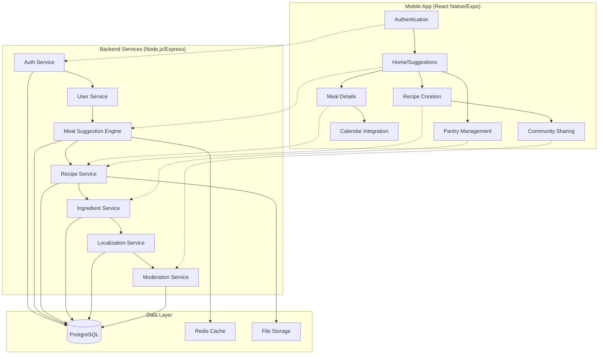

# Design Document

## Overview

Akelny is a React Native mobile application built with Expo, featuring a Node.js/Express backend with PostgreSQL database. The architecture supports bilingual content (English/Arabic) with RTL layout, real-time meal suggestions based on ingredient availability, and a community-driven recipe sharing system.

## Architecture

### High-Level Architecture



### Technology Stack

- **Frontend**: React Native with Expo SDK
- **Backend**: Node.js with Express.js framework
- **Database**: PostgreSQL with connection pooling
- **Caching**: Redis for session management and frequently accessed data
- **Authentication**: JWT tokens with bcrypt password hashing
- **File Storage**: Cloud storage for recipe images
- **Localization**: i18next for React Native with RTL support
- **State Management**: Redux Toolkit with RTK Query for API calls

## Components and Interfaces

### Core Components

#### 1. Authentication System
- **JWT Token Management**: Secure token storage using Expo SecureStore
- **Social Login Integration**: Optional OAuth providers (Google, Facebook)
- **Password Security**: bcrypt hashing with salt rounds
- **Session Management**: Redis-based session storage with configurable expiration

#### 2. Meal Suggestion Engine
- **Filtering Algorithm**: Multi-criteria filtering based on:
  - Mandatory ingredient availability (hard constraint)
  - Meal type (breakfast/lunch/dinner)
  - Kitchen preferences
  - Previous day exclusion
  - User favorites weighting
- **Random Selection**: Weighted random selection from eligible meals
- **Caching Strategy**: Redis caching of suggestion results with 1-hour TTL

#### 3. Localization System
- **Content Structure**: Dual-field approach (field_en, field_ar) for all translatable content
- **RTL Layout**: Automatic layout mirroring using I18nManager
- **Font Management**: Dynamic font loading (Inter for English, Noto Kufi Arabic for Arabic)
- **Fallback Strategy**: Graceful degradation to default language when translations missing

#### 4. Ingredient Management
- **Status Classification**: Enum-based system (mandatory, recommended, optional)
- **Nutritional Calculation**: Automatic aggregation of per-ingredient nutrition data
- **Pantry Synchronization**: Real-time sync between device and server
- **User Contributions**: Moderated ingredient addition with attribution

### API Interface Design

#### Authentication Endpoints
```typescript
POST /api/auth/signup
Body: { name: string, email: string, password: string, country: string, language: 'en'|'ar' }
Response: { user: User, token: string, refreshToken: string }

POST /api/auth/login
Body: { email: string, password: string }
Response: { user: User, token: string, refreshToken: string }

POST /api/auth/refresh
Body: { refreshToken: string }
Response: { token: string, refreshToken: string }
```

#### Meal Suggestion Endpoints
```typescript
GET /api/meals/suggest
Query: { mealType?: string, kitchenIds?: string[], excludeRecent?: boolean }
Response: { meals: Meal[], totalCount: number, appliedFilters: FilterSummary }

POST /api/meals/filter-by-pantry
Body: { pantryIngredientIds: string[], strictMode: boolean }
Response: { eligibleMeals: Meal[], partialMatches: PartialMatch[] }

GET /api/meals/random
Query: { count?: number, filters?: MealFilters }
Response: { meals: Meal[] }
```

#### User Data Endpoints
```typescript
GET /api/user/profile
Response: { user: User, preferences: UserPreferences }

PUT /api/user/pantry
Body: { ingredientIds: string[] }
Response: { success: boolean, updatedPantry: string[] }

POST /api/user/calendar
Body: { mealId: string, scheduledDate: string, notes?: string }
Response: { calendarEntry: CalendarEntry }
```

## Data Models

### Core Entities

#### User Model
```sql
CREATE TABLE users (
    id UUID PRIMARY KEY DEFAULT gen_random_uuid(),
    name VARCHAR(255) NOT NULL,
    email VARCHAR(255) UNIQUE NOT NULL,
    password_hash VARCHAR(255) NOT NULL,
    country VARCHAR(2) NOT NULL,
    primary_kitchen_id UUID REFERENCES kitchens(id),
    language VARCHAR(2) DEFAULT 'en' CHECK (language IN ('en', 'ar')),
    created_at TIMESTAMP DEFAULT CURRENT_TIMESTAMP,
    updated_at TIMESTAMP DEFAULT CURRENT_TIMESTAMP
);

CREATE INDEX idx_users_email ON users(email);
CREATE INDEX idx_users_country ON users(country);
```

#### Kitchen Model
```sql
CREATE TABLE kitchens (
    id UUID PRIMARY KEY DEFAULT gen_random_uuid(),
    name_en VARCHAR(255) NOT NULL,
    name_ar VARCHAR(255),
    description_en TEXT,
    description_ar TEXT,
    icon_url VARCHAR(500),
    is_active BOOLEAN DEFAULT true,
    created_at TIMESTAMP DEFAULT CURRENT_TIMESTAMP
);

CREATE INDEX idx_kitchens_active ON kitchens(is_active);
```

#### Ingredient Model
```sql
CREATE TABLE ingredients (
    id UUID PRIMARY KEY DEFAULT gen_random_uuid(),
    name_en VARCHAR(255) NOT NULL,
    name_ar VARCHAR(255),
    category VARCHAR(100),
    default_unit VARCHAR(50),
    calories_per_100g DECIMAL(8,2),
    protein_per_100g DECIMAL(8,2),
    carbs_per_100g DECIMAL(8,2),
    fat_per_100g DECIMAL(8,2),
    minerals JSONB,
    user_created_by UUID REFERENCES users(id),
    is_approved BOOLEAN DEFAULT false,
    created_at TIMESTAMP DEFAULT CURRENT_TIMESTAMP
);

CREATE INDEX idx_ingredients_name_en ON ingredients USING gin(to_tsvector('english', name_en));
CREATE INDEX idx_ingredients_name_ar ON ingredients USING gin(to_tsvector('arabic', name_ar));
CREATE INDEX idx_ingredients_category ON ingredients(category);
```

#### Meal Model
```sql
CREATE TABLE meals (
    id UUID PRIMARY KEY DEFAULT gen_random_uuid(),
    title_en VARCHAR(255) NOT NULL,
    title_ar VARCHAR(255),
    description_en TEXT,
    description_ar TEXT,
    kitchen_id UUID REFERENCES kitchens(id),
    servings INTEGER DEFAULT 1,
    prep_time_min INTEGER,
    cook_time_min INTEGER,
    steps_en JSONB,
    steps_ar JSONB,
    nutrition_totals JSONB,
    image_url VARCHAR(500),
    created_by_user_id UUID REFERENCES users(id),
    is_public BOOLEAN DEFAULT false,
    is_approved BOOLEAN DEFAULT false,
    created_at TIMESTAMP DEFAULT CURRENT_TIMESTAMP,
    updated_at TIMESTAMP DEFAULT CURRENT_TIMESTAMP
);

CREATE INDEX idx_meals_kitchen ON meals(kitchen_id);
CREATE INDEX idx_meals_public ON meals(is_public, is_approved);
CREATE INDEX idx_meals_creator ON meals(created_by_user_id);
```

#### Meal-Ingredient Relationship
```sql
CREATE TABLE meal_ingredients (
    id UUID PRIMARY KEY DEFAULT gen_random_uuid(),
    meal_id UUID REFERENCES meals(id) ON DELETE CASCADE,
    ingredient_id UUID REFERENCES ingredients(id),
    quantity DECIMAL(10,3) NOT NULL,
    unit VARCHAR(50) NOT NULL,
    status VARCHAR(20) NOT NULL CHECK (status IN ('mandatory', 'recommended', 'optional')),
    calories_contribution DECIMAL(8,2),
    nutrition_contribution JSONB,
    created_at TIMESTAMP DEFAULT CURRENT_TIMESTAMP
);

CREATE INDEX idx_meal_ingredients_meal ON meal_ingredients(meal_id);
CREATE INDEX idx_meal_ingredients_ingredient ON meal_ingredients(ingredient_id);
CREATE INDEX idx_meal_ingredients_status ON meal_ingredients(status);
```

### Relationship Models

#### User Pantry
```sql
CREATE TABLE user_pantry (
    user_id UUID REFERENCES users(id) ON DELETE CASCADE,
    ingredient_id UUID REFERENCES ingredients(id),
    added_at TIMESTAMP DEFAULT CURRENT_TIMESTAMP,
    PRIMARY KEY (user_id, ingredient_id)
);
```

#### User Favorites
```sql
CREATE TABLE user_favorites (
    user_id UUID REFERENCES users(id) ON DELETE CASCADE,
    meal_id UUID REFERENCES meals(id) ON DELETE CASCADE,
    added_at TIMESTAMP DEFAULT CURRENT_TIMESTAMP,
    PRIMARY KEY (user_id, meal_id)
);
```

#### Calendar Entries
```sql
CREATE TABLE calendar_entries (
    id UUID PRIMARY KEY DEFAULT gen_random_uuid(),
    user_id UUID REFERENCES users(id) ON DELETE CASCADE,
    meal_id UUID REFERENCES meals(id),
    scheduled_date DATE NOT NULL,
    notes TEXT,
    created_at TIMESTAMP DEFAULT CURRENT_TIMESTAMP
);

CREATE INDEX idx_calendar_user_date ON calendar_entries(user_id, scheduled_date);
```

## Error Handling

### API Error Response Format
```typescript
interface ApiError {
    error: {
        code: string;
        message: string;
        details?: any;
        timestamp: string;
        requestId: string;
    }
}
```

### Error Categories

#### 1. Authentication Errors
- `AUTH_001`: Invalid credentials
- `AUTH_002`: Token expired
- `AUTH_003`: Insufficient permissions
- `AUTH_004`: Account suspended

#### 2. Validation Errors
- `VAL_001`: Missing required fields
- `VAL_002`: Invalid data format
- `VAL_003`: Data constraint violation
- `VAL_004`: File upload validation failed

#### 3. Business Logic Errors
- `BIZ_001`: No meals match pantry criteria
- `BIZ_002`: Recipe already exists
- `BIZ_003`: Cannot delete system ingredients
- `BIZ_004`: Meal already scheduled for date

#### 4. System Errors
- `SYS_001`: Database connection failed
- `SYS_002`: External service unavailable
- `SYS_003`: Cache service error
- `SYS_004`: File storage error

### Client-Side Error Handling
- **Network Errors**: Automatic retry with exponential backoff
- **Validation Errors**: Real-time form validation with localized messages
- **Offline Mode**: Queue operations for sync when connection restored
- **User Feedback**: Toast notifications and error boundaries for graceful degradation

## Testing Strategy

### Unit Testing
- **Backend Services**: Jest with 80%+ code coverage
- **API Endpoints**: Supertest for integration testing
- **Database Operations**: Test database with transaction rollback
- **Business Logic**: Isolated testing of meal suggestion algorithm

### Frontend Testing
- **Component Testing**: React Native Testing Library
- **Navigation Testing**: Mock navigation and test screen transitions
- **State Management**: Redux store testing with mock data
- **Localization Testing**: Automated tests for RTL layout and translations

### Integration Testing
- **API Integration**: End-to-end API testing with real database
- **Authentication Flow**: Complete login/signup/logout cycles
- **Meal Suggestion Flow**: Full pantry-to-suggestion pipeline testing
- **Calendar Integration**: Cross-platform calendar API testing

### Performance Testing
- **Database Queries**: Query performance analysis with EXPLAIN
- **API Response Times**: Load testing with realistic data volumes
- **Mobile Performance**: Memory usage and rendering performance
- **Caching Effectiveness**: Cache hit rates and invalidation testing

### Accessibility Testing
- **Screen Reader Compatibility**: VoiceOver (iOS) and TalkBack (Android)
- **Color Contrast**: WCAG AA compliance verification
- **Touch Target Sizes**: Minimum 44px touch targets
- **RTL Layout**: Comprehensive RTL layout testing

### Localization Testing
- **Translation Completeness**: Automated checks for missing translations
- **Text Expansion**: UI layout testing with longer Arabic text
- **Date/Number Formatting**: Locale-specific formatting verification
- **Font Rendering**: Arabic font rendering across different devices